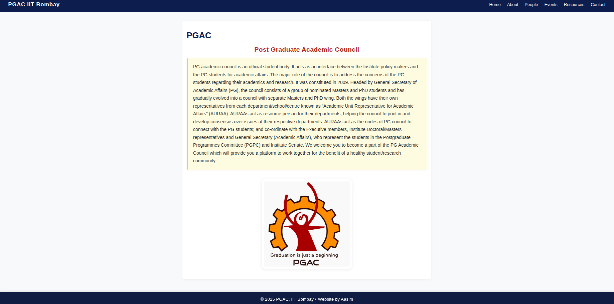

# PGAC-Demo

A modern, static multi-page website for the Post Graduate Academic Council (PGAC), IIT Bombay. Built with semantic HTML and CSS for clarity, accessibility, and responsiveness.

## Features
- Responsive navigation bar and layout
- Modern card-based design for people, events, and resources
- Consistent, fixed footer on every page
- Fully static, no JavaScript required

## Home Page Preview

## Usage
Open any of the HTML files in your browser. No build step required.

## Author
© 2025 PGAC, IIT Bombay • Website by Aasim
