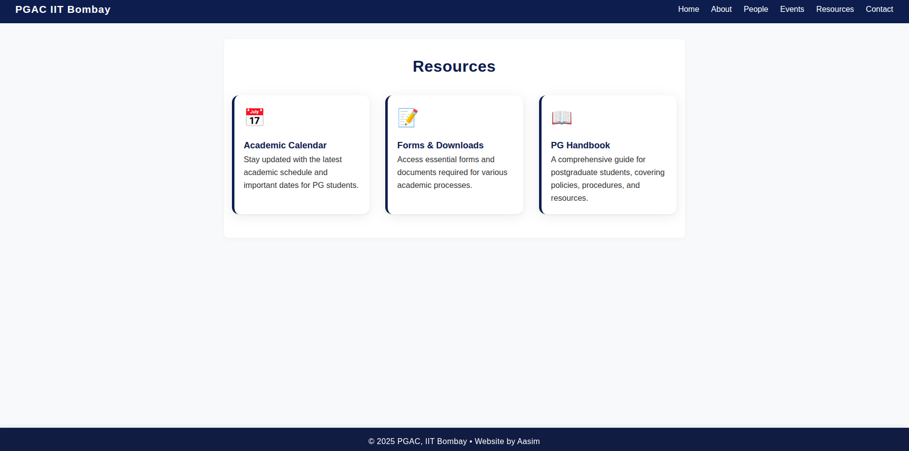

# PGAC-Demo

A modern, static multi-page website for the Post Graduate Academic Council (PGAC), IIT Bombay. Built with semantic HTML and CSS for clarity, accessibility, and responsiveness.

## Features
- Responsive navigation bar and layout
- Modern card-based design for people, events, and resources
- Consistent, fixed footer on every page
- Fully static, no JavaScript required

## Home Page Preview

## People Page Preview

The People page features a modern, responsive card layout for council members and roles. Each card includes a placeholder for a photo, the role title, and the name or description. Example:

- Institute Secretary International Relations (PG): Trashna Thakur
- General Secretary Academic Affairs: Kunal Kailash Sharma
- Institute Secretary Academic Affairs (Masters): [Name]
- Institute Secretary Academic Affairs (Doctoral): [Name]
- Academic Council Coordinator (ACC): [Name]
- Academic Unit Representative for Academic Affairs: [List of AURAAs]

## Events Page Preview

The Events page displays upcoming and past events in a responsive card grid. Each card shows the event date, title, and a short description. Example events:

- **Aug 15, 2025** — Children's Day Celebration: Fun activities and workshops for children of PG students and staff. Open to all families!
- **Sep 10, 2025** — PG Orientation Program: Welcome event for new PG students. Meet your council, learn about resources, and get your questions answered.
- **Oct 5, 2025** — Research Symposium: Showcase your research, attend talks, and network with peers and faculty.
- **Nov 20, 2025** — Alumni Talks: Hear from successful PG alumni about their journeys and career advice.

## Resources Page Preview

The Resources page presents important links and documents for PG students in a modern card layout. Example resources:

- **Academic Calendar**: Stay updated with the latest academic schedule and important dates for PG students.
- **Forms & Downloads**: Access essential forms and documents required for various academic processes.
- **PG Handbook**: A comprehensive guide for postgraduate students, covering policies, procedures, and resources.

## Usage
Open any of the HTML files in your browser. No build step required.

## Author
© 2025 PGAC, IIT Bombay • Website by Aasim
